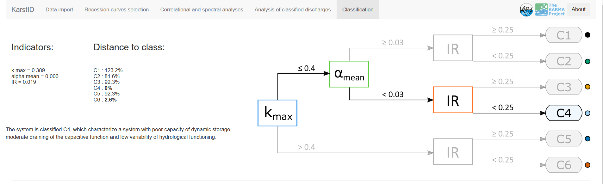

<!-- README.md is generated from README.Rmd. Please edit that file -->

```{r, include = FALSE}
knitr::opts_chunk$set(
  collapse = TRUE,
  comment = "#>",
  fig.path = "man/figures/README-",
  out.width = "100%"
)
```

# KarstID: Analysis of Karst Spring Hydrographs

Guillaume Cinkus, Naomi Mazzilli and Hervé Jourde

<!-- badges: start -->
<!-- badges: end -->

## Description

KarstID is an R Package devoted to the analysis of karst systems hydrological functioning developed in the R Shiny framework. The package consists in an interactive application that can be loaded through a web browser or the RStudio viewer.

The goal of KarstID is to facilitate the completion of common analyses of karst spring hydrographs such as:

- Statistical analyses
- Recession curves analysis
- Correlationnal and spectal analyses
- Analyses of classified discharges

The application also provides the classification of karst systems hydrological functioning based on the proposal of Cinkus et al. (2021) and offers to compare the results with a database of 78 karst systems located worldwide.

The KarstID package is open source, actively developed and available on Github (https://github.com/busemorose/KarstID). 

§§§§§§§§§§§§§§§§ IN THE FUTURE ??????? §§§§§§§§§§§§§§§§§§§§§§§§

## Installation

KarstID requires an installation of R.  **It is recommended to use at least R `4.0.0`**. Note that it is possible to install the package with an R version prior to `4.0.0` but some conflicts may exist. You can download and find the instructions for the installation of R on the [CRAN website](https://cran.r-project.org/).

Once R is installed, you can install KarstID from [GitHub](https://github.com/busemorose/KarstID).

``` r
if (!require("devtools")) install.packages("devtools") # install devtools package if needed
devtools::install_github("busemorose/KarstID") # install KarstID package
```

## Launch

Once the package is installed, you can load the application with the `KarstID()` function.

```{r example, eval=FALSE}
library(KarstID)
KarstID()
```

## Features

### Data import

```{r data-import, echo=FALSE}

```

### Hydrodynamic analyses

```{r recession-selection, echo=FALSE}
knitr::include_graphics("gif/recession_curves_selection.gif")
```

```{r recession-model, echo=FALSE}
knitr::include_graphics("gif/recession_curves_model.gif")
```

```{r cs-analyses, echo=FALSE}
knitr::include_graphics("gif/cs_analyses.gif")
```

```{r classified-q, echo=FALSE}
knitr::include_graphics("gif/classified_q.png")
```

### Classification

```{r classif-system, echo=FALSE}

```

```{r classif-database, echo=FALSE}
knitr::include_graphics("gif/classif_database.gif")
```

## License

```{r license, echo=FALSE}
htmltools::includeHTML("inst/extdata/license.html")
```

## References

```{r references, echo=FALSE}
htmltools::includeHTML("inst/extdata/references.html")
```


