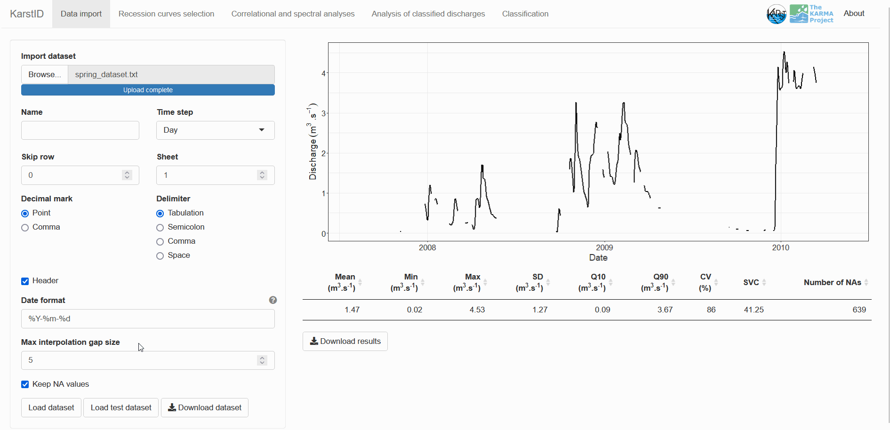
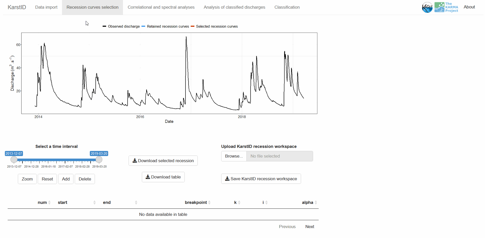
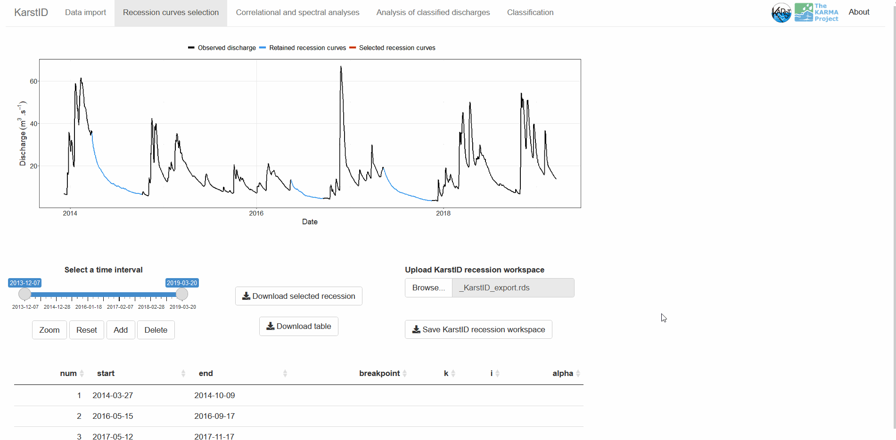
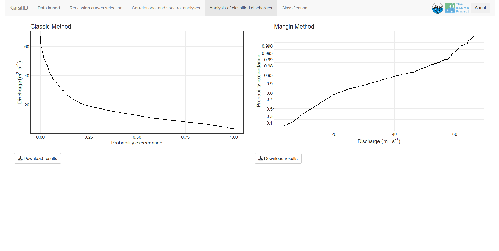
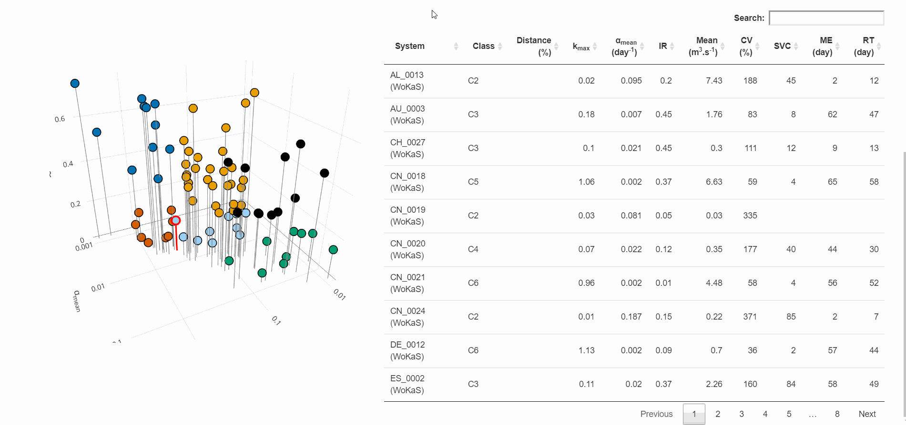

<!-- README.md is generated from README.Rmd. Please edit that file -->

```{r, include = FALSE}
knitr::opts_chunk$set(
  collapse = TRUE,
  comment = "#>",
  fig.path = "man/figures/README-",
  out.width = "100%"
)
```

# KarstID: Analysis of Karst Spring Hydrographs

Guillaume Cinkus, Naomi Mazzilli and Hervé Jourde

<!-- badges: start -->
<!-- badges: end -->

## Description

KarstID is an R Package devoted to the analysis of karst systems hydrological functioning. The package consists in an interactive application that can be loaded through a web browser or the RStudio viewer. The application is developed in the R Shiny framework.

The goal of KarstID is to facilitate the completion of common analyses of karst spring hydrographs such as:

- Statistical analyses
- Recession curves analysis
- Simple correlational and spectral analyses
- Analyses of classified discharges

The equations behind the analyses and the calculation of the indicators are detailed in Cinkus et al. (2021) (https://doi.org/10.1016/j.jhydrol.2021.127006). The application also provides the classification of karst systems hydrological functioning based on the proposal of Cinkus et al. (2021) and offers to compare the results with a database of 78 karst systems located worldwide (Olarinoye et al., 2020, https://doi.org/10.1038/s41597-019-0346-5). 

The KarstID package is open source, actively developed and available on Github (https://github.com/busemorose/KarstID). We will try to address user requests (new features or bug report). We also consider future developments such as different recession models, or adding other hydrodynamic analyses.

## Installation

KarstID requires an installation of R.  **It is recommended to use at least R `4.0.0`**. Note that it is possible to install the package with an R version prior to `4.0.0` but some conflicts may exist. The instruction for the installation and the download of R can be found on the [CRAN website](https://cran.r-project.org/).

Once R is installed, KarstID can be installed from [GitHub](https://github.com/busemorose/KarstID).

``` r
if (!require("devtools")) install.packages("devtools") # install devtools package if needed
devtools::install_github("busemorose/KarstID") # install KarstID package
```

## Launch

Once the package is installed, the application can be loaded with the `KarstID()` function.

``` r
library(KarstID)
KarstID()
```

## Features

### Data import

The data import tab allows to load a spring discharge time series:

- The data must be a plain text or Excel file 
- The file must have two columns representing date and discharge, respectively 
- The discharge must be in m^3^/s

The import options allows the user to define:

- `Name`: will be used for export file names and plot displays
- `Time step`: time step of the imported time series
- `Skip row`: number of rows to skip at the beginning of the file
- `Sheet`: sheet number if Excel file
- `Decimal mark`: decimal mark of the discharge values
- `Delimiter`: delimiter of the columns
- `Header`: presence of header or not (if no header, column names will be defaulted to `date` and `discharge`)
- `Compute and use daily mean`: only for hourly time step. If checked, compute and use daily mean from (infra) hourly data
- `Date format`: format of the date (e.g. `%Y-%m-%d %H:%M:%S` for a date-time format)

After defining the import options, the user can click on `Load dataset` to import his data. The application will:

- Look for missing date entries (adapted to the time step of the time series) and fill the blanks if necessary
- Interpolate missing discharge values if the user want to
- Apply a daily or hourly mean depending on the user preference and the initial time step
- Display the hydrograph on the import page

It is also possible to use a "test dataset" as demonstrated below.

```{r data-import, echo=FALSE}
knitr::include_graphics("gif/data_import.gif")
```

### Missing discharge interpolation

It is possible to interpolate missing values when importing discharge data:

- `Max interpolation gap size`: define the maximum gap (in days) which will be interpolated with a spline function
- `Keep NA values`: define the behaviour when there are still missing values after the interpolation (even if no interpolation). If checked, the whole time series with missing values will be loaded. If unchecked, only the longest part of the time series without missing values will be loaded

```{r interp, echo=FALSE}

```

### Hydrodynamic analyses

#### Recession curves

The recession curves analysis tab allows to select recession curves and apply recession model. The recession selection is done with a slider and four buttons:

- `Select a time interval`: define the time interval of the plot
- `Zoom`: zoom on the plot according to the dimensions of the mouse brush
- `Reset`: reset the default (full) time interval
- `Add`: add the selected recession curve (dimensions of the mouse brush) to the KarstID workspace. A recap of the information is displayed in the table below
- `Delete`: delete the selected recession curve in the table from the KarstID workspace

It is possible to save the time series of the selected recession curves with the `Download selected recession` button and save the recap table with the `Download table` button. It is possible to save and import the entire KarstID workspace with the `Save KarstID recession workspace` and `Upload KarstID recession workspace`, respectively.

```{r recession-selection, echo=FALSE}

```

Once the recession curves are saved, they all appear in the table below and can be selected. When selected, the recession model interface is displayed on the right. The workflow is:

- Remove potential perturbations on the recession with the `Remove spikes in the recession curve` checkbox
- Click on the plot or enter a number in the `Breakpoint value` numeric input to define the inflexion point of the Mangin model (Mangin, 1975)
- Calculate and retain indicators of functioning with the `Save indicators` button. The indicators appear in the recap table. It is possible to cancel the results with `Clear selection`

```{r recession-model, echo=FALSE}

```

#### Signal analyses

The simple correlational and spectral analyses tab allows to visualize the results of these signal analyses proposed by Mangin (1984). The results are calculated automatically once a dataset is imported. It is possible to change the cutting point (in days) with the slider input below the graphs. 

```{r cs-analyses, echo=FALSE}
knitr::include_graphics("gif/cs_analyses.gif")
```

#### Classified discharges

The analysis of classified discharges tab allows to visualize the results of the classic approach and the Mangin (1971) approach. The results are calculated automatically once a dataset is imported.

```{r classified-q, echo=FALSE}

```

### Classification

The classification tab can be appreciated in four parts:

- The top left text (i) reminds the values of the indicators, (ii) gives the distance to other classes, and (iii) displays a description of the hydrological functioning of the system according to its class
- The top right flowchart indicates how the system is classified according to the values of the indicators of functioning
- The bottom right table contains the classes and indicators values of 78 karst systems located worldwide. By default, they are ordered by distance to the investigated system
- The bottom left plot shows the investigated system (highlighted in red) alongside the 78 other karst systems. It is possible to select a system in the table to highlight it in yellow on the plot The axis correspond to the three indicators of functioning used for the classification

```{r classif-system, echo=FALSE}
knitr::include_graphics("gif/classif_system.png")
```

```{r classif-database, echo=FALSE}

```

## License

```{r license, echo=FALSE}
htmltools::includeHTML("inst/extdata/license.html")
```

## References

```{r references, echo=FALSE}
htmltools::includeHTML("inst/extdata/references.html")
```


