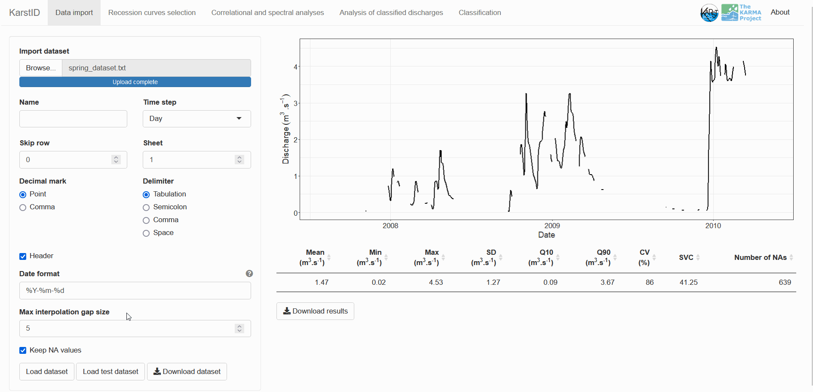
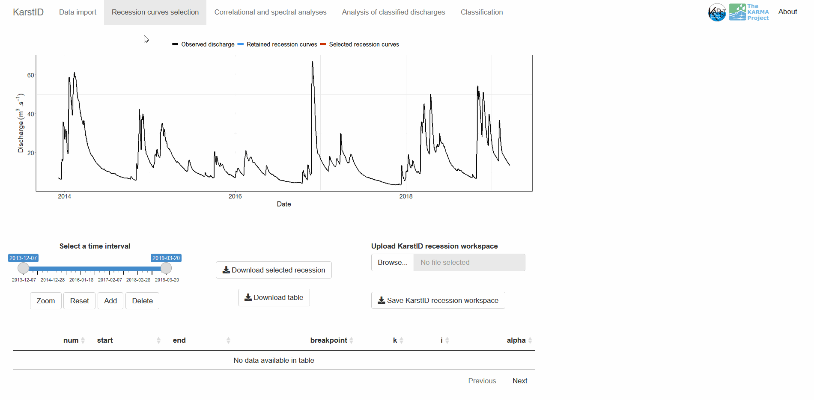
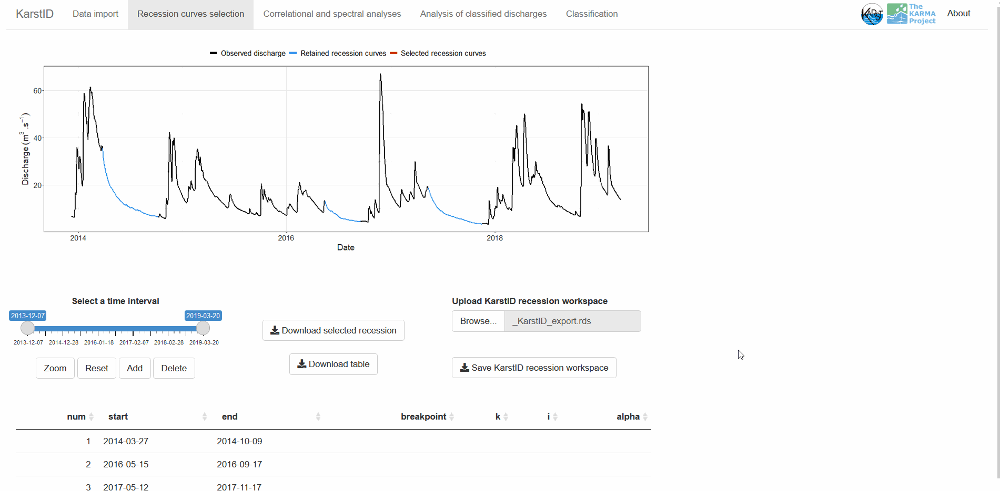
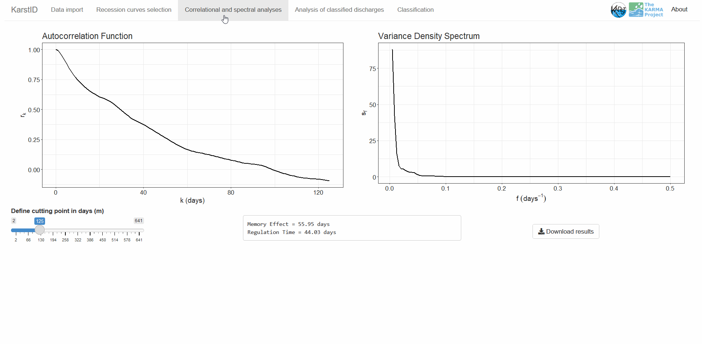
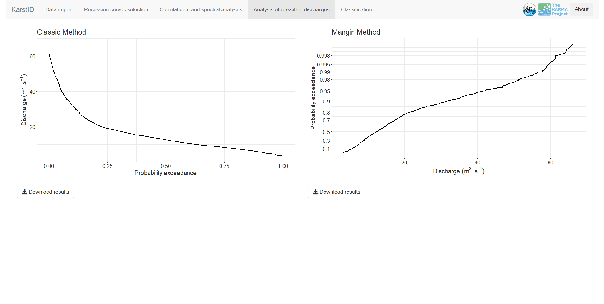
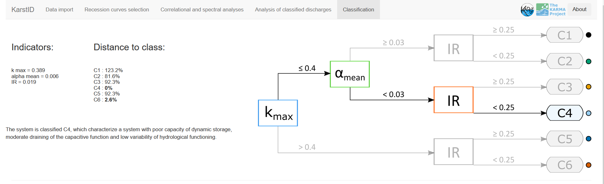
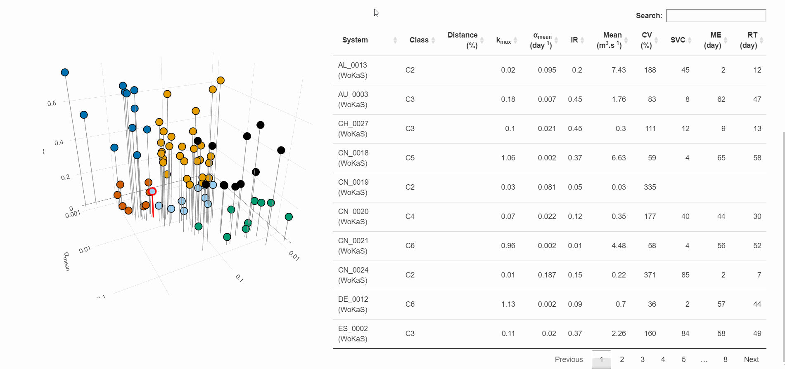

- [KarstID: Analysis of Karst Spring
  Hydrographs](#karstid-analysis-of-karst-spring-hydrographs)
  - [Description](#description)
  - [Installation](#installation)
  - [Launch](#launch)
  - [Features](#features)
    - [Data import](#data-import)
    - [Missing discharge
      interpolation](#missing-discharge-interpolation)
    - [Hydrodynamic analyses](#hydrodynamic-analyses)
    - [Classification](#classification)
  - [License](#license)
  - [References](#references)

<!-- README.md is generated from README.Rmd. Please edit that file -->

# KarstID: Analysis of Karst Spring Hydrographs

Guillaume Cinkus, Naomi Mazzilli and Hervé Jourde

Download the User Guide:

1.  Go to <https://hal.archives-ouvertes.fr/hal-03688332/>
2.  Right-click on the User Guide HTML file in `Annex`
3.  Click on `Save Link As...`

<!-- badges: start -->
<!-- badges: end -->

## Description

KarstID is an R Package devoted to the analysis of karst systems
hydrological functioning. The package consists in an interactive
application that can be loaded through a web browser or the RStudio
viewer. The application is developed in the R Shiny framework.

The goal of KarstID is to facilitate the completion of common analyses
of karst spring hydrographs such as:

- Statistical analyses
- Recession curves analysis
- Simple correlational and spectral analyses
- Analyses of classified discharges

The equations behind the analyses and the calculation of the indicators
are detailed in Cinkus et al. (2021)
(<https://doi.org/10.1016/j.jhydrol.2021.127006>). The application also
provides the classification of karst systems hydrological functioning
based on the proposal of Cinkus et al. (2021) and offers to compare the
results with a database of 78 karst systems located worldwide (Olarinoye
et al., 2020, <https://doi.org/10.1038/s41597-019-0346-5>).

The KarstID package is open source, actively developed and available on
Github (<https://github.com/busemorose/KarstID>). We will try to address
user requests (new features or bug report). We also consider future
developments such as different recession models, or adding other
hydrodynamic analyses.

## Installation

KarstID requires an installation of R. **It is recommended to use at
least R `4.0.0`**. Note that it is possible to install the package with
an R version prior to `4.0.0` but some conflicts may exist. The
instruction for the installation and the download of R can be found on
the [CRAN website](https://cran.r-project.org/).

Once R is installed, KarstID can be installed from
[GitHub](https://github.com/busemorose/KarstID).

``` r
if (!require("remotes")) install.packages("remotes") # install remotes package if needed
remotes::install_github("busemorose/KarstID") # install KarstID package
```

## Launch

Once the package is installed, the application can be loaded with the
`KarstID()` function.

``` r
library(KarstID)
KarstID()
```

## Features

### Data import

The data import tab allows to load a spring discharge time series:

- The data must be a plain text or Excel file
- The file must have two columns representing date and discharge,
  respectively
- The discharge must be in m<sup>3</sup>/s

The import options allows the user to define:

- `Name`: will be used for export file names and plot displays
- `Time step`: time step of the imported time series
- `Skip row`: number of rows to skip at the beginning of the file
- `Sheet`: sheet number if Excel file
- `Decimal mark`: decimal mark of the discharge values
- `Delimiter`: delimiter of the columns
- `Header`: presence of header or not (if no header, column names will
  be defaulted to `date` and `discharge`)
- `Compute and use daily mean`: only for hourly time step. If checked,
  compute and use daily mean from (infra) hourly data
- `Date format`: format of the date (e.g. `%Y-%m-%d %H:%M:%S` for a
  date-time format)

After defining the import options, the user can click on `Load dataset`
to import his data. The application will:

- Look for missing date entries (adapted to the time step of the time
  series) and fill the blanks if necessary
- Interpolate missing discharge values if the user want to
- Apply a daily or hourly mean depending on the user preference and the
  initial time step
- Display the hydrograph on the import page

It is also possible to use a “test dataset” as demonstrated below.


### Missing discharge interpolation

It is possible to interpolate missing values when importing discharge
data:

- `Max interpolation gap size`: define the maximum gap (in days) which
  will be interpolated with a spline function
- `Keep NA values`: define the behaviour when there are still missing
  values after the interpolation (even if no interpolation). If checked,
  the whole time series with missing values will be loaded. If
  unchecked, only the longest part of the time series without missing
  values will be loaded



### Hydrodynamic analyses

#### Recession curves

The recession curves analysis tab allows to select recession curves and
apply recession model. The recession selection is done with a slider and
four buttons:

- `Select a time interval`: define the time interval of the plot
- `Zoom`: zoom on the plot according to the dimensions of the mouse
  brush
- `Reset`: reset the default (full) time interval
- `Add`: add the selected recession curve (dimensions of the mouse
  brush) to the KarstID workspace. A recap of the information is
  displayed in the table below
- `Delete`: delete the selected recession curve in the table from the
  KarstID workspace

It is possible to save the time series of the selected recession curves
with the `Download selected recession` button and save the recap table
with the `Download table` button. It is possible to save and import the
entire KarstID workspace with the `Save KarstID recession workspace` and
`Upload KarstID recession workspace`, respectively.



Once the recession curves are saved, they all appear in the table below
and can be selected. When selected, the recession model interface is
displayed on the right. The workflow is:

- Remove potential perturbations on the recession with the
  `Remove spikes in the recession curve` checkbox
- Click on the plot or enter a number in the `Breakpoint value` numeric
  input to define the inflexion point of the Mangin model (Mangin, 1975)
- Calculate and retain indicators of functioning with the
  `Save indicators` button. The indicators appear in the recap table. It
  is possible to cancel the results with `Clear selection`



#### Signal analyses

The simple correlational and spectral analyses tab allows to visualize
the results of these signal analyses proposed by Mangin (1984). The
results are calculated automatically once a dataset is imported. It is
possible to change the cutting point (in days) with the slider input
below the graphs.



#### Classified discharges

The analysis of classified discharges tab allows to visualize the
results of the classic approach and the Mangin (1971) approach. The
results are calculated automatically once a dataset is imported.



### Classification

The classification tab can be appreciated in four parts:

- The top left text (i) reminds the values of the indicators, (ii) gives
  the distance to other classes, and (iii) displays a description of the
  hydrological functioning of the system according to its class
- The top right flowchart indicates how the system is classified
  according to the values of the indicators of functioning
- The bottom right table contains the classes and indicators values of
  78 karst systems located worldwide. By default, they are ordered by
  distance to the investigated system
- The bottom left plot shows the investigated system (highlighted in
  red) alongside the 78 other karst systems. It is possible to select a
  system in the table to highlight it in yellow on the plot The axis
  correspond to the three indicators of functioning used for the
  classification





## License

<a rel="license" href="http://creativecommons.org/licenses/by/4.0/"></a><br />This work is licensed under a <a rel="license" href="http://creativecommons.org/licenses/by/4.0/">Creative Commons Attribution 4.0 International License</a>

## References

    #> Warning: `includeHTML()` was provided a `path` that appears to be a complete HTML document.
    #> ✖ Path: inst/extdata/references.html
    #> ℹ Use `tags$iframe()` to include an HTML document. You can either ensure `path` is accessible in your app or document (see e.g. `shiny::addResourcePath()`) and pass the relative path to the `src` argument. Or you can read the contents of `path` and pass the contents to `srcdoc`.

<!DOCTYPE html PUBLIC "-//W3C//DTD XHTML 1.1//EN" "http://www.w3.org/TR/xhtml11/DTD/xhtml11.dtd">
<html xmlns="http://www.w3.org/1999/xhtml" xml:lang="en">
<head>
<meta http-equiv="Content-Type" content="text/html; charset=utf-8"/>
<title>Bibliographie</title>
</head>
<body>
<div class="csl-bib-body" style="line-height: 1.35; margin-left: 2em; text-indent:-2em;">
  <div class="csl-entry">Cinkus, G., Mazzilli, N., Jourde, H., 2021. Identification of relevant indicators for the assessment of karst systems hydrological functioning: Proposal of a new classification. J. Hydrol. 603, 127006. <a href="https://doi.org/10.1016/j.jhydrol.2021.127006">https://doi.org/10.1016/j.jhydrol.2021.127006</a></div>
  <span class="Z3988" title="url_ver=Z39.88-2004&amp;ctx_ver=Z39.88-2004&amp;rfr_id=info%3Asid%2Fzotero.org%3A2&amp;rft_id=info%3Adoi%2F10.1016%2Fj.jhydrol.2021.127006&amp;rft_val_fmt=info%3Aofi%2Ffmt%3Akev%3Amtx%3Ajournal&amp;rft.genre=article&amp;rft.atitle=Identification%20of%20relevant%20indicators%20for%20the%20assessment%20of%20karst%20systems%20hydrological%20functioning%3A%20Proposal%20of%20a%20new%20classification&amp;rft.jtitle=Journal%20of%20Hydrology&amp;rft.stitle=J.%20Hydrol.&amp;rft.volume=603&amp;rft.aufirst=Guillaume&amp;rft.aulast=Cinkus&amp;rft.au=Guillaume%20Cinkus&amp;rft.au=Naomi%20Mazzilli&amp;rft.au=Herv%C3%A9%20Jourde&amp;rft.date=2021-12-01&amp;rft.pages=127006&amp;rft.issn=0022-1694&amp;rft.language=en"></span>
  <div class="csl-entry">Mangin, A., 1984. Pour une meilleure connaissance des systèmes hydrologiques à partir des analyses corrélatoire et spectrale. J. Hydrol. 67, 25–43. <a href="https://doi.org/10.1016/0022-1694(84)90230-0">https://doi.org/10.1016/0022-1694(84)90230-0</a></div>
  <span class="Z3988" title="url_ver=Z39.88-2004&amp;ctx_ver=Z39.88-2004&amp;rfr_id=info%3Asid%2Fzotero.org%3A2&amp;rft_id=info%3Adoi%2F10.1016%2F0022-1694(84)90230-0&amp;rft_val_fmt=info%3Aofi%2Ffmt%3Akev%3Amtx%3Ajournal&amp;rft.genre=article&amp;rft.atitle=Pour%20une%20meilleure%20connaissance%20des%20syst%C3%A8mes%20hydrologiques%20%C3%A0%20partir%20des%20analyses%20corr%C3%A9latoire%20et%20spectrale&amp;rft.jtitle=Journal%20of%20Hydrology&amp;rft.stitle=J.%20Hydrol.&amp;rft.volume=67&amp;rft.issue=1%E2%80%934&amp;rft.aufirst=Alain&amp;rft.aulast=Mangin&amp;rft.au=Alain%20Mangin&amp;rft.date=1984&amp;rft.pages=25-43&amp;rft.spage=25&amp;rft.epage=43&amp;rft.issn=00221694&amp;rft.language=fr"></span>
  <div class="csl-entry">Mangin, A., 1975. Contribution à l’étude hydrodynamique des aquifères karstiques (PhD). Université de Dijon, France.<a href="https://hal.archives-ouvertes.fr/tel-01575806"> https://hal.archives-ouvertes.fr/tel-01575806</a></div>
  <span class="Z3988" title="url_ver=Z39.88-2004&amp;ctx_ver=Z39.88-2004&amp;rfr_id=info%3Asid%2Fzotero.org%3A2&amp;rft_val_fmt=info%3Aofi%2Ffmt%3Akev%3Amtx%3Adissertation&amp;rft.title=Contribution%20%C3%A0%20l'%C3%A9tude%20hydrodynamique%20des%20aquif%C3%A8res%20karstiques&amp;rft.aufirst=Alain&amp;rft.aulast=Mangin&amp;rft.au=Alain%20Mangin&amp;rft.date=1975&amp;rft.tpages=268"></span>
  <div class="csl-entry">Mangin, A., 1971. Etude des débits classés d’exutoires karstiques portant sur un cycle hydrologique. Ann. spéléol. 26, 283–329.</div>
  <span class="Z3988" title="url_ver=Z39.88-2004&amp;ctx_ver=Z39.88-2004&amp;rfr_id=info%3Asid%2Fzotero.org%3A2&amp;rft_val_fmt=info%3Aofi%2Ffmt%3Akev%3Amtx%3Ajournal&amp;rft.genre=article&amp;rft.atitle=Etude%20des%20d%C3%A9bits%20class%C3%A9s%20d'exutoires%20karstiques%20portant%20sur%20un%20cycle%20hydrologique&amp;rft.jtitle=Annales%20de%20sp%C3%A9l%C3%A9ologie&amp;rft.stitle=Ann.%20sp%C3%A9l%C3%A9ol.&amp;rft.volume=26&amp;rft.issue=2&amp;rft.aufirst=Alain&amp;rft.aulast=Mangin&amp;rft.au=Alain%20Mangin&amp;rft.date=1971&amp;rft.pages=283-329&amp;rft.spage=283&amp;rft.epage=329"></span>
  <div class="csl-entry">Olarinoye, T., Gleeson, T., Marx, V., Seeger, S., Adinehvand, R., Allocca, V., Andreo, B., Apaéstegui, J., Apolit, C., Arfib, B., Auler, A., Bailly-Comte, V., Barberá, J.A., Batiot-Guilhe, C., Bechtel, T., Binet, S., Bittner, D., Blatnik, M., Bolger, T., Brunet, P., Charlier, J.-B., Chen, Z., Chiogna, G., Coxon, G., De Vita, P., Doummar, J., Epting, J., Fleury, P., Fournier, M., Goldscheider, N., Gunn, J., Guo, F., Guyot, J.L., Howden, N., Huggenberger, P., Hunt, B., Jeannin, P.-Y., Jiang, G., Jones, G., Jourde, H., Karmann, I., Koit, O., Kordilla, J., Labat, D., Ladouche, B., Liso, I.S., Liu, Z., Maréchal, J.-C., Massei, N., Mazzilli, N., Mudarra, M., Parise, M., Pu, J., Ravbar, N., Sanchez, L.H., Santo, A., Sauter, M., Seidel, J.-L., Sivelle, V., Skoglund, R.Ø., Stevanovic, Z., Wood, C., Worthington, S., Hartmann, A., 2020. Global karst springs hydrograph dataset for research and management of the world’s fastest-flowing groundwater. Sci. Data 7, 59. <a href="https://doi.org/10.1038/s41597-019-0346-5">https://doi.org/10.1038/s41597-019-0346-5</a></div>
  <span class="Z3988" title="url_ver=Z39.88-2004&amp;ctx_ver=Z39.88-2004&amp;rfr_id=info%3Asid%2Fzotero.org%3A2&amp;rft_id=info%3Adoi%2F10.1038%2Fs41597-019-0346-5&amp;rft_val_fmt=info%3Aofi%2Ffmt%3Akev%3Amtx%3Ajournal&amp;rft.genre=article&amp;rft.atitle=Global%20karst%20springs%20hydrograph%20dataset%20for%20research%20and%20management%20of%20the%20world%E2%80%99s%20fastest-flowing%20groundwater&amp;rft.jtitle=Scientific%20Data&amp;rft.stitle=Sci.%20Data&amp;rft.volume=7&amp;rft.issue=1&amp;rft.aufirst=Tunde&amp;rft.aulast=Olarinoye&amp;rft.au=Tunde%20Olarinoye&amp;rft.au=Tom%20Gleeson&amp;rft.au=Vera%20Marx&amp;rft.au=Stefan%20Seeger&amp;rft.au=Rouhollah%20Adinehvand&amp;rft.au=Vincenzo%20Allocca&amp;rft.au=Bartolome%20Andreo&amp;rft.au=James%20Apa%C3%A9stegui&amp;rft.au=Christophe%20Apolit&amp;rft.au=Bruno%20Arfib&amp;rft.au=Augusto%20Auler&amp;rft.au=Vincent%20Bailly-Comte&amp;rft.au=Juan%20Antonio%20Barber%C3%A1&amp;rft.au=Christelle%20Batiot-Guilhe&amp;rft.au=Timothy%20Bechtel&amp;rft.au=Stephane%20Binet&amp;rft.au=Daniel%20Bittner&amp;rft.au=Matej%20Blatnik&amp;rft.au=Terry%20Bolger&amp;rft.au=Pascal%20Brunet&amp;rft.au=Jean-Baptiste%20Charlier&amp;rft.au=Zhao%20Chen&amp;rft.au=Gabriele%20Chiogna&amp;rft.au=Gemma%20Coxon&amp;rft.au=Pantaleone%20De%20Vita&amp;rft.au=Joanna%20Doummar&amp;rft.au=Jannis%20Epting&amp;rft.au=Perrine%20Fleury&amp;rft.au=Matthieu%20Fournier&amp;rft.au=Nico%20Goldscheider&amp;rft.au=John%20Gunn&amp;rft.au=Fang%20Guo&amp;rft.au=Jean%20Loup%20Guyot&amp;rft.au=Nicholas%20Howden&amp;rft.au=Peter%20Huggenberger&amp;rft.au=Brian%20Hunt&amp;rft.au=Pierre-Yves%20Jeannin&amp;rft.au=Guanghui%20Jiang&amp;rft.au=Greg%20Jones&amp;rft.au=Herve%20Jourde&amp;rft.au=Ivo%20Karmann&amp;rft.au=Oliver%20Koit&amp;rft.au=Jannes%20Kordilla&amp;rft.au=David%20Labat&amp;rft.au=Bernard%20Ladouche&amp;rft.au=Isabella%20Serena%20Liso&amp;rft.au=Zaihua%20Liu&amp;rft.au=Jean-Christophe%20Mar%C3%A9chal&amp;rft.au=Nicolas%20Massei&amp;rft.au=Naomi%20Mazzilli&amp;rft.au=Mat%C3%ADas%20Mudarra&amp;rft.au=Mario%20Parise&amp;rft.au=Junbing%20Pu&amp;rft.au=Nata%C5%A1a%20Ravbar&amp;rft.au=Liz%20Hidalgo%20Sanchez&amp;rft.au=Antonio%20Santo&amp;rft.au=Martin%20Sauter&amp;rft.au=Jean-Luc%20Seidel&amp;rft.au=Vianney%20Sivelle&amp;rft.au=Rannveig%20%C3%98vrevik%20Skoglund&amp;rft.au=Zoran%20Stevanovic&amp;rft.au=Cameron%20Wood&amp;rft.au=Stephen%20Worthington&amp;rft.au=Andreas%20Hartmann&amp;rft.date=2020-12&amp;rft.pages=59&amp;rft.issn=2052-4463&amp;rft.language=en"></span>
</div></body>
</html>
